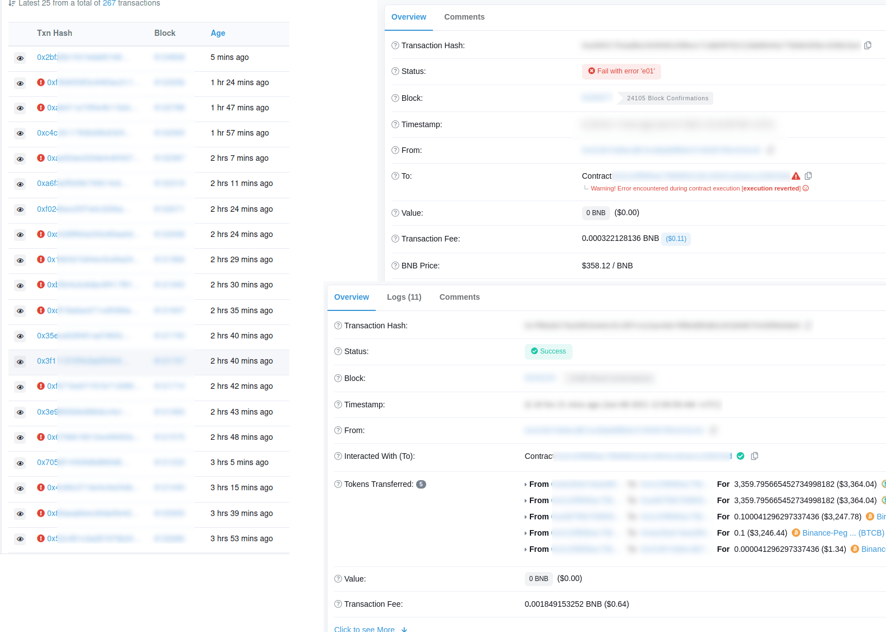

# Uniswap Arbitrage Flash Swap Contract

You want to play with "millions" on the blockchain then try https://uniswap.org/docs/v2/smart-contract-integration/using-flash-swaps/. This contract is able to arbitrage between DEX on the blockchain without providing any own capital.
Basically is usable on the **Binance Smart Chain** and provides callbacks for common DEX, feel free to extend.

**This is not a full project, build your or own infrastructure around it!**

## Links

 * https://github.com/yuyasugano/pancake-bakery-arbitrage 
 * https://github.com/Uniswap/uniswap-v2-periphery/blob/master/contracts/examples/ExampleFlashSwap.sol

## Transactions



## Improvements

All examples are more or less overengineered for a quick start, so here we have a KISS solution.

 * Reduce overall contract size for low gas fee on deployment
 * Provide a on chain validation contract method to let nodes check arbitrage opportunities
 * Stop arbitrage opportunity execution as soon as possible if its already gone to reduce gas fee on failure
 * Interface callbacks for common DEX on "Binance Smart Chain" are included

## Infrastructure

Basically arbitrage opportunity dont last long, your transaction must make it into the next block. So you have <3 seconds watching for opportunities, decide and execute transaction. Sometimes there are also a chance to 2-3 have block, see example below.  

```
[7920960] [6/1/2021, 5:50:37 PM]: alive (bsc-ws-node.nariox.org) - took 308.42 ms
[7920991] [6/1/2021, 5:52:09 PM]: [bsc-ws-node.nariox.org] [BAKE/BNB ape>bakery] Arbitrage opportunity found! Expected profit: 0.007 $2.43 - 0.10%
[7920991] [6/1/2021, 5:52:09 PM] [bsc-ws-node.nariox.org]: [BAKE/BNB ape>bakery] and go:  {"profit":"$1.79","profitWithoutGasCost":"$2.43","gasCost":"$0.64","duration":"539.35 ms","provider":"bsc-ws-node.nariox.org"}
[7920992] [6/1/2021, 5:52:13 PM]: [bsc-ws-node.nariox.org] [BAKE/BNB ape>bakery] Arbitrage opportunity found! Expected profit: 0.007 $2.43 - 0.10%
[7920992] [6/1/2021, 5:52:13 PM] [bsc-ws-node.nariox.org]: [BAKE/BNB ape>bakery] and go:  {"profit":"$1.76","profitWithoutGasCost":"$2.43","gasCost":"$0.67","duration":"556.28 ms","provider":"bsc-ws-node.nariox.org"}
[7921000] [6/1/2021, 5:52:37 PM]: alive (bsc-ws-node.nariox.org) - took 280.54 ms
```

### Requirements / Hints

 * You have a time window of 1000ms every 3 seconds (blocktime on BSC) and you should make it into the next transaction
 * Websocket connection is needed to listen directly for new incoming blocks 
 * Public provided Websocket are useless `bsc-ws-node.nariox.org` simply they are way behind notify new blocks
 * Use a non public provider; or build your own node (light node helps) and better have multiple owns; let the fastest win
 * Spread your transaction execution around all possible providers, first one wins (in any case transactions are only execute once based on `nonce`)
 * Find suitable pairs with liquidity but not with much transaction
 * You can play with full pair liquidity, but dont be too greedy think of a price impact you would have
 * Common opportunities are just between 0,5 - 1%
 * Do not estimate transaction fee, just calculate it once and provide a static gas limit. Simply its takes to long
 * There is block parameter until the transaction is valid, so you can abort execution eg after +3 blocks
 * Payback is directly calculated by calling the foreign contracts so its project independent (no hardcoded fee calculation) 
 * The profit is transferred to the owner / creator of the contract :)

### Function

The contract is plain and simple [contracts/Flashswap.sol] some basic hints:

Check arbitrage opportunity between DEX. Read only method the one blockchain

```
    function check(
        address _tokenBorrow, // example: BUSD
        uint256 _amountTokenPay, // example: BNB => 10 * 1e18
        address _tokenPay, // example: BNB
        address _sourceRouter,
        address _targetRouter
    ) public view returns(int256, uint256) {
```

Starts the execution. You are able to estimate the gas usage of the function, its also directly validating the opportunity. Its slow depending on connected nodes.

```
    function start(
        uint _maxBlockNumber,
        address _tokenBorrow, // example BUSD
        uint256 _amountTokenPay,
        address _tokenPay, // our profit and what we will get; example BNB
        address _sourceRouter,
        address _targetRouter,
        address _sourceFactory
    ) external {
```

As all developers are lazy and just forking projects around without any rename a common implementation is possible. Basically the pair contract call the foreign method of the contract. You can find them the naming in any pair contract inside the `swap()` method.

Example: https://bscscan.com/address/0x0eD7e52944161450477ee417DE9Cd3a859b14fD0#code: `if (data.length > 0) IPancakeCallee(to).pancakeCall(msg.sender, amount0Out, amount1Out, data);`

Extend method if needed:

```
# internal callback 
function execute(address _sender, uint256 _amount0, uint256 _amount1, bytes calldata _data) internal

# foreign methods that get called
function pancakeCall(address _sender, uint256 _amount0, uint256 _amount1, bytes calldata _data) external
function uniswapV2Call(address _sender, uint256 _amount0, uint256 _amount1, bytes calldata _data) external
```

### Run it

Its not a full infrastructure, but a working workflow, if you deploy the contract.

``` bash
cp env.template .env # replace values inside ".env"
node watcher.js
```

```
started: wallet 0xXXXX - gasPrice 5000000000 - contract owner: 0xXXXX
[bsc-ws-node.nariox.org] You are connected on 0xXXXX
[8124531] [6/8/2021, 7:53:20 PM]: [bsc-ws-node.nariox.org] [BUSD/BNB pancake>panther] Arbitrage checked! Expected profit: -0.015 $-4.99 - -0.15%
[8124532] [6/8/2021, 7:53:21 PM]: [bsc-ws-node.nariox.org] [BUSD/BNB pancake>panther] Arbitrage checked! Expected profit: -0.015 $-4.99 - -0.15%
[8124533] [6/8/2021, 7:53:24 PM]: [bsc-ws-node.nariox.org] [BUSD/BNB pancake>panther] Arbitrage checked! Expected profit: -0.014 $-4.71 - -0.14%
[8124534] [6/8/2021, 7:53:27 PM]: [bsc-ws-node.nariox.org] [BUSD/BNB pancake>panther] Arbitrage checked! Expected profit: -0.014 $-4.61 - -0.14%
```

#### Hints

 * Designed to have multiple chain connectivities, play with some non public providers to be faster then the public once. Its all designed as "first win"
 